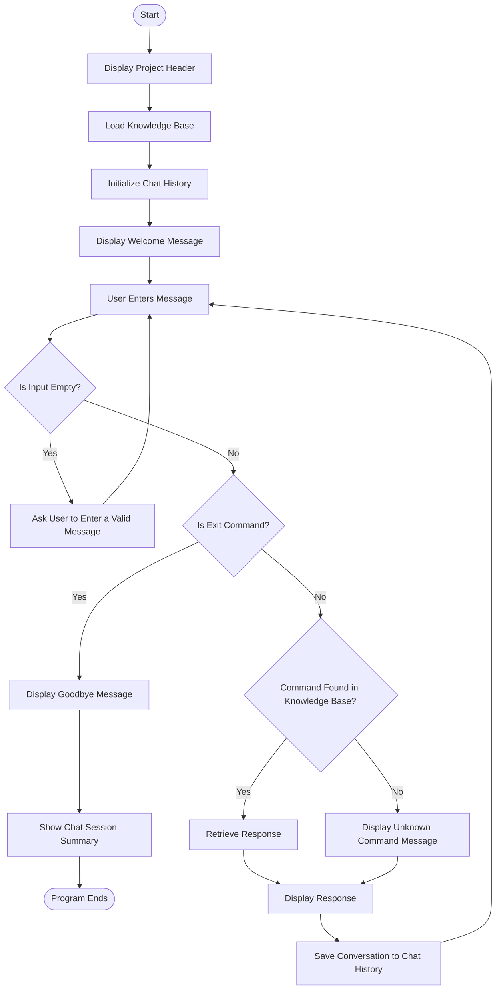

   <p align="center">
  
</p>

<p align="center">
  
  
  
  
  
</p>

# 🤖 Rule-Based AI Chatbot
⭐A beginner-friendly Artificial Intelligence chatbot built with Python using rule-based logic and conditional statements.
Developed as part of the DecodeLabs Artificial Intelligence Internship.

## 📖 Table of Contents
* Project Overview
* Features
* Technologies Used
* Project Structure
* Installation
* Screenshot
* Sample Output
* Learning Outcomes
* Future Improvements
* Author

## 🌟 Project Overview

The Rule-Based AI Chatbot is a console-based chatbot developed using Python. It responds to user inputs through predefined rules and conditional statements, demonstrating the core concepts of Rule-Based Artificial Intelligence without relying on Machine Learning or external AI libraries.
* ✨ Key Features
* 🤝 Interactive chatbot conversation
* 👋 Personalized greetings
* 🤖 Answers AI-related questions
* 🐍 Provides Python programming information
* 📅 Displays current date
* 🕒 Displays current time
* ➕ Performs arithmetic calculations
* 💡 Generates motivational quotes
* 🎲 Shares random fun facts
* ❓ Handles unknown inputs politely
* 🔁 Continuous conversation using a while loop
* 🚪 Graceful exit command

| Technology | Purpose              |
| ---------- | -------------------- |
| Python 3   | Programming Language |
| datetime   | Date & Time          |
| random     | Quotes & Fun Facts   |
| time       | Time Functions       |

## 🧠 AI Concepts Used
* Rule-Based AI
* Knowledge Base
* Decision Making
* Conditional Statements
* Control Flow
* Loops
* User Interaction
* Function

 ## 📂 Project Structure


                                                                     
                                                                     |

## ▶️ How to Run

## 1️⃣ Clone the Repository

```bash
git clone https://github.com/vaishnavibansal222-ctrl/Decodelabs-Internship.git
```

## 2️⃣ Navigate to the Project Directory

```bash
cd Decodelabs-Internship
```

## 3️⃣ Run the Rule-Based AI Chatbot

```bash
python "PROJECT-1 VAISHNAVI.py"
```

## 📚 Screenshot 

# Functionality 


# Interface 


  
💬 Sample Conversation
==================================================
           RULE-BASED AI CHATBOT
           Developed By Vaishnavi Bansal
==================================================

You : hello

Bot : Hello! Welcome to the Rule-Based AI Chatbot.

You : what is ai

Bot : Artificial Intelligence enables computers to perform tasks that normally require human intelligence.

You : time

Bot : Current Time : 04:15 PM

You : quote

Bot : Success is the sum of small efforts repeated every day.

You : fun fact

Bot : Octopuses have three hearts.

You : bye

Bot : Thank you for using the chatbot.
Have a wonderful day!

## 📚 Learning Outcomes
* Python Programming
* Artificial Intelligence Basics
* Rule-Based Systems
* Decision Making
* Loops & Conditional Statements
* User Input Handling
* Problem Solving

## 🚀 Future Enhancements
* NLP Integration
* Voice Assistant
* GUI using Tkinter
* Weather API
* Wikipedia Search
* Speech Recognition
* Text-to-Speech
* Chat History
* Database Integration

## 👩‍💻 Author

## Vaishnavi Bansal

Artificial Intelligence Intern @ DecodeLabs

🌐 MY Socials:
[](https://linkedin.com/in/www.linkedin.com/in/vaishnavi-bansal-95896b384) [](mailto:vaishnavibansal222@gmail.com)  

## ⭐ Support

If you found this project useful, please consider giving it a ⭐ on GitHub.


```
